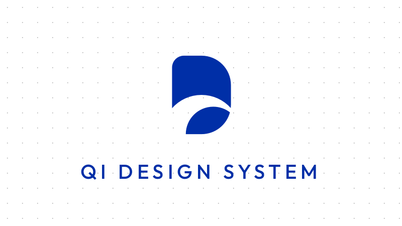

# Qi Design System

Describe the design system once and output multiple framework configs (Tailwind, Chakra UI, Ant Design, etc.).

Languages: [中文](./README.zh-cn.md) | [English](./README.md)

## Quick Start

## Features & Roadmap

### Color System Definition

- [ ] Color System
  - [ ] Single-color Palette Generation
    - [x] Ant Design Color
    - [ ] Mantine Colors Generator
  - [ ] Triadic Color Scheme
  - [x] Semantic Definition (Based on Chakra UI Semantic Specifications)
  - [ ] Dark Mode
- [ ] Typography System
  - [x] Font Sizes (Semantic Definition Only)
  - [x] Line Heights
    - [x] Linear Automatic Generation
  - [x] Font Weights (Semantic Definition Only)
- [x] Spacing System
- [ ] Border Radii
- [ ] Shadows

### Built-in Configuration Generators

- [x] Tailwind V4
- [ ] Tailwind V3
- [ ] Ant Design
- [ ] Chakra UI
- [ ] Mantine

## Contribution

* Requires the Bun runtime environment (v1.3.0+).